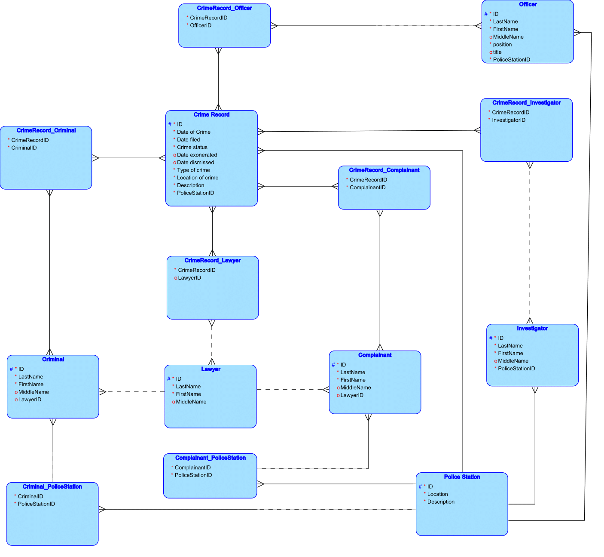

**Crime Data Management System**

The Crime Data Management System is a database-driven crime tracking
solution designed to store and analyze crime data among different police
stations. Serving as an IT solution for law enforcement agencies, this
system enhances crime data collection, analysis, and visualization to
improve public safety and strategic decision-making.

By streamlining crime records, the system ensures data integrity,
consistency, and real-time updates, allowing police officers to
efficiently report, retrieve, and manage case information. Additionally,
the system has tentative predictive analytics and geographic mapping
capabilities that can help identify crime patterns, detect high-risk
areas, and support resource allocation.

With its structured data management and potential for advanced
analytics, this system aims to enhance crime prevention efforts, improve
law enforcement response, and strengthen overall security within
communities.

**Objectives**

1.  **Develop a Centralized Crime Database**

    - Store and manage detailed crime records, including date, location,
      type, severity, and suspect details.

    - Maintain data consistency and real-time updates across police
      stations.

2.  **Enhance Crime Reporting & Data Management**

    - Provide a comprehensive interface for authorized police personnel
      to enter, update, and retrieve crime reports.

    - Improve data accuracy and accessibility for case tracking and
      analysis.

3.  **Enable Predictive Crime Analysis (Tentative Feature)**

    - Analyze historical and real-time crime data to identify patterns
      and high-risk areas.

    - Retrievable reports to assist law enforcement agencies in
      strategic planning and crime prevention.

4.  **Implement Geographic Crime Mapping (Tentative Feature)**

    - Display heat maps for visualizing crime distribution and comparing
      high-crime vs. low-crime areas.

    - Assist law enforcement in identifying priority zones for resource
      deployment.

**ERD Entities and Attributes**

| **Crime Records**     |                                  |                 |
|-----------------------|----------------------------------|-----------------|
| **Attributes**        | **Key Type**                     | **Requirement** |
| **ID**                | **Primary Key**                  | **Required**    |
| **Date of Crime**     | **-**                            | **Required**    |
| **Date Filed**        | **-**                            | **Required**    |
| **Crime Status**      | **-**                            | **Required**    |
| **Date Exonerated**   | **-**                            | **Optional**    |
| **Date Dismissed**    | **-**                            | **Optional**    |
| **Type of Crime**     | **-**                            | **Required**    |
| **Location of Crime** | **-**                            | **Required**    |
| **Description**       | **-**                            | **Required**    |
| **PoliceStationID**   | **Foreign Key (Police Station)** | **Required**    |

| **Criminal**   |                 |                        |
|----------------|-----------------|------------------------|
| **Attributes** | **Key Type**    | **Required/ Optional** |
| **ID**         | **Primary Key** | **Required**           |
| **LastName**   | **-**           | **Required**           |
| **FirstName**  | **-**           | **Required**           |
| **MiddleName** | **-**           | **Optional**           |
| **LawyerID**   | **Foreign Key** | **Optional**           |

| **CrimeRecord_Criminal** |                               |                        |
|--------------------------|-------------------------------|------------------------|
| **Attributes**           | **Key Type**                  | **Required/ Optional** |
| **CrimeRecordID**        | **Foreign Key(Crime Record)** | **Required**           |
| **CriminalID**           | **Foreign Key (Criminal)**    | **Required**           |

| **CrimeRecord_PoliceStation** |                                  |                        |
|-------------------------------|----------------------------------|------------------------|
| **Attributes**                | **Key Type**                     | **Required/ Optional** |
| **CrimeRecordID**             | **Foreign Key (Crime Record)**   | **Required**           |
| **PoliceStationID**           | **Foreign Key (Police Station)** | **Required**           |

| **Complainant** |                 |                        |
|-----------------|-----------------|------------------------|
| **Attributes**  | **Key Type**    | **Required/ Optional** |
| **ID**          | **Primary Key** | **Required**           |
| **LastName**    | **-**           | **Required**           |
| **FirstName**   | **-**           | **Required**           |
| **MiddleName**  | **-**           | **Optional**           |
| **LawyerID**    | **Foreign Key** | **Optional**           |

| **Complainant_PoliceStation** |                 |                        |
|-------------------------------|-----------------|------------------------|
| **Attributes**                | **Key Type**    | **Required/ Optional** |
| **ComplainantID**             | **Foreign Key** | **Required**           |
| **PoliceStationID**           | **Foreign Key** | **Required**           |

| **CrimeRecord_Complainant** |                 |                        |
|-----------------------------|-----------------|------------------------|
| **Attributes**              | **Key Type**    | **Required/ Optional** |
| **CrimeRecordID**           | **Foreign Key** | **Required**           |
| **ComplainantID**           | **Foreign Key** | **Required**           |

| **Lawyer**     |                 |                        |
|----------------|-----------------|------------------------|
| **Attributes** | **Key Type**    | **Required/ Optional** |
| **LawyerID**   | **Primary Key** | **Required**           |
| **LastName**   | **-**           | **Required**           |
| **FirstName**  | **-**           | **Required**           |
| **MiddleName** | **-**           | **Optional**           |

| **CrimeRecord_Lawyer** |                 |                        |
|------------------------|-----------------|------------------------|
| **Attributes**         | **Key Type**    | **Required/ Optional** |
| **CrimeRecordID**      | **Foreign Key** | **Required**           |
| **LawyerID**           | **Foreign Key** | **Required**           |

| **Investigator**    |                 |                        |
|---------------------|-----------------|------------------------|
| **Attributes**      | **Key Type**    | **Required/ Optional** |
| **InvestigatorID**  | **Primary Key** | **Required**           |
| **LastName**        | **-**           | **Required**           |
| **FirstName**       | **-**           | **Required**           |
| **MiddleName**      | **-**           | **Optional**           |
| **PoliceStationID** | **Foreign Key** | **Required**           |

| **CrimeRecord_Investigator** |                 |                        |
|------------------------------|-----------------|------------------------|
| **Attributes**               | **Key Type**    | **Required/ Optional** |
| **CrimeRecordID**            | **Foreign Key** | **Required**           |
| **InvestigatorID**           | **Foreign Key** | **Required**           |

| **Police Station**  |                 |                        |
|---------------------|-----------------|------------------------|
| **Attributes**      | **Key Type**    | **Required/ Optional** |
| **PoliceStationID** | **Primary Key** | **Required**           |
| **Location**        | **-**           | **Required**           |
| **Description**     | **-**           | **Required**           |

| **Officer**         |                 |                 |
|---------------------|-----------------|-----------------|
| **Attributes**      | **Key Type**    | **Requirement** |
| **OfficerID**       | **Primary Key** | **Required**    |
| **LastName**        | **-**           | **Required**    |
| **FirstName**       | **-**           | **Required**    |
| **MiddleName**      | **-**           | **Optional**    |
| **Title**           | **-**           | **Required**    |
| **PoliceStationID** | **Foreign Key** | **Required**    |

| **CrimeRecord_Officer** |                 |                 |
|-------------------------|-----------------|-----------------|
| **Attributes**          | **Key Type**    | **Requirement** |
| **CrimeRecordID**       | **Foreign Key** | **Required**    |
| **OfficerID**           | **Foreign Key** | **Required**    |

**Discussion of Attributes**

1\. Crime Record

The attributes present in the crime record table would help in getting
specific details of the crime. One may know the status of the crime and
optionally identify the date of exoneration or dismissal if it has been
done. The police department ID is in connection to the Police Department
table to identify the station where the crime record is kept.

2\. Criminal

The attributes under criminal are their ID, name, and optionally their
lawyer's ID. This table

is also in connection with the crime record wherein it helps the crime
record to identify the

criminal's details.

3\. Crime Record & Criminal

> This serves as a junction table to avoid redundancy and link the crime
> record and criminal into a many-to-many relationship. This is the
> connection of the two tables wherein it helps the crime record to
> identify the criminal's details

4\. Police Station

> The attributes under police station are the ID, location, and
> description. These attributes help in identifying the specific
> location of the station and describe the station itself.

5\. Criminal & Police Station

> This serves as a junction table to avoid redundancy and link the
> criminal and police station into a many-to-many relationship. This is
> the connection of the two tables wherein it identifies where the
> criminal's police station was.

6\. Complainant

> The attributes under complainant are the ID, name, and optionally
> their lawyer. These attributes give details about the complainant.

7\. Complainant & Police Station

> This serves as a junction table to avoid redundancy and link the
> complainant and police station into a many-to-many relationship. This
> is the connection of the two tables wherein it identifies where the
> complainant's police station was.

8\. Crime Record & Complainant

> This serves as a junction table to avoid redundancy and link the crime
> record and complainant into a many-to-many relationship. This is the
> connection of the two tables wherein it identifies in which crime
> records the complainants are in.

9\. Lawyer

> The attributes in this table are the lawyer's ID and name. These gives
> details about the lawyer. Lawyers are an optional entity in the
> diagram and in the tables because they are not always assigned.

10\. Crime Record & Lawyer

> This serves as a junction table to avoid redundancy and link the crime
> record and lawyer into a many-to-many relationship. This is the
> connection of the two tables wherein it identifies in which crime
> records the lawyers are in.

11\. Investigator

> The attributes in this table are the investigator's ID, name, and
> police station. These give details about the investigator and in which
> station they are assigned.

12\. Crime Record & Investigator

> This serves as a junction table to avoid redundancy and link the crime
> record and investigator into a many-to-many relationship. This is the
> connection of the two tables wherein it identifies in which crime
> records the investigators are in.

13\. Officer

> The attributes in this table are the officer's id, name, and police
> station. These give details about the officer and in which station
> they are assigned along with their position.

14\. Crime Record & Officer

> This serves as a junction table to avoid redundancy and link the crime
> record and officer into a many-to-many relationship. This is the
> connection of the two tables wherein it identifies in which crime
> records the officers are in.

**Establishing Relationships**

1\. Crime Records & Criminal (Many-to-Many)

- Each crime record must have one or many criminals and each criminal
  must have one or many crime records.

2\. Crime Record & Officer (Many-to-Many)

- Each crime record must have one or many officers assigned and each
  office may be assigned to one or many crime records.

3\. Crime Record & Complainant (Many-to-Many)

- Each crime record must have one or many complainants and each
  complainant must be linked to one or many crime records.

4\. Crime Record & Lawyer (Many-to-Many)

- Each crime record may have one or many lawyers and each lawyer may
  have one or many crime records.

5\. Crime Record & Investigator (Many-to-Many)

- Each crime record must have one or many investigators and each
  investigator may have been a part of one or many criminal records.

6\. Criminal & Police Station (Many-to-Many)

- Each criminal may be linked to one or many police stations and each
  police station may have one or many criminals recorded.

7\. Complainant & Police Station (Many-to-Many)

- Each complainant may report at one or many police station and each
  police station may receive one or many complaints from one or many
  complainants.

8\. Investigator & Police Station (One-to-Many)

- Each investigator must be assigned to one police station and each
  police station may have one or many investigators.

9\. Officer & Police Station (One-to-Many)

- Each officer must be assigned to one police station and each police
  station may have one or many investigators.

10\. Lawyer & Crime Record (Many-to-Many)

- Each lawyer may handle one or many crime records and each crime
  records may have one or many lawyers assigned.

11\. Lawyer & Complainant (One-to-Many)

- Each complainant may have one lawyer and each lawyer may handle one or
  many complainants.

12\. Lawyer & Criminal (One-to-Many)

- Each criminal may have one lawyer and each lawyer may handle one or
  many criminals.

**ERD Diagram**

**ERD Reflection**

The design process of the ERD was quite difficult to implement,
specifically in identifying the entities and their assigned attributes.
The group researched about what happens in a crime and who are usually
involved, thus allowing them to create this ERD Diagram and the schema.
As discussed above, reasons have been specified or simplified to further
understand the project's concepts.

**Team Members**
  
  - Jeferson Ruiz A. Cabalsa
  
  - Dave Andrei P. Capistrano
  
  - Aerron Sander V. Gumarao
  
  - Stephen Raine V. Villeta
  
